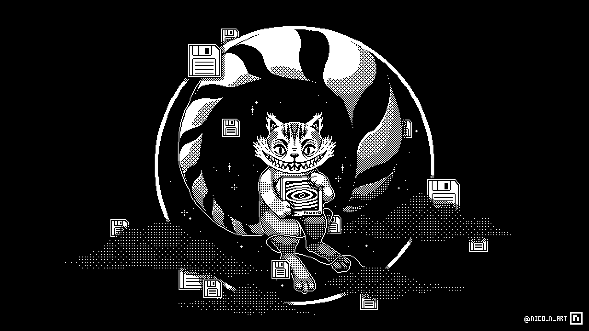

**title**: `Só o conhecimento liberta`

**date**: `2025-10-07`

**tags**: `[Arquitetura de computadores]`

**difficulty**: `Iniciante`

**status**: `Feito`

# Resumo
Às `23:12 horas` do dia `2025-10-07` estou começando um desafio, onde eu quero me torna um especialista renomado, não quero ser igual o `Dark Tangent`, mas quero trilhar o meu próprio caminho, uma pessoa diferenciada com um grande conhecimento. Hoje, quero compartilhar uma história que começou com uma simples curiosidade e se transformou em uma jornada de aprendizado, superação e realização. Tudo começou com a Dark Web, um mundo desconhecido e misterioso para muitos, mas que, para mim, se tornou o ponto de partida para algo muito maior.

# Objetivo
 Ter um impacto positivo, Trabalhar para causar um impacto positivo na vida dos membros e, potencialmente, na sociedade como um todo.
Construção de Rede, criar uma rede de contatos e relacionamentos que proporcionem suporte, oportunidades e inspiração ao longo do tempo.

# Referências
- <a href="https://defcon.org/html/links/dtangent.html">Dark Tangent</a>

#

  

<h3 align="center">💾 O que é memória num mundo onde tudo se apaga e se recria? 🌀</h3>

Um eco da era cibernética, onde dados flutuam e o tempo é apenas um loop.

